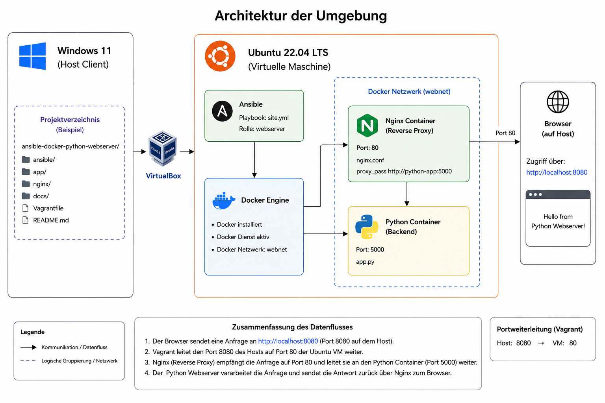

# Automatisierte Bereitstellung einer Webanwendung mit Ansible, Docker, Nginx und Python

## Inhaltsverzeichnis

1. Einleitung
2. Projektziel
3. Anforderungen
4. Verwendete Technologien
5. Systemarchitektur
6. Projektstruktur
7. Umsetzung
8. Ansible-Automatisierung
9. Funktionstest
10. Zielerreichung
11. GitHub Repository
12. Fazit
13. Quellen

---

# 1. Einleitung

Im Rahmen dieses Projekts wurde eine automatisierte Webserver-Umgebung mit Vagrant, Ansible und Docker erstellt.

Ziel war die Bereitstellung einer virtuellen Ubuntu-Maschine, welche vollständig automatisiert konfiguriert wird. Als Anwendungsbeispiel wurde eine einfache Python-Webanwendung implementiert, welche über einen Nginx Reverse Proxy erreichbar ist.

Das Projekt orientiert sich am Konzept **Infrastructure as Code (IaC)**. Infrastruktur und Konfigurationen werden dabei nicht manuell eingerichtet, sondern durch Code beschrieben und automatisiert bereitgestellt.

---

# 2. Projektziel

Ziel des Projekts ist die automatisierte Bereitstellung einer Webanwendung mittels Ansible.

Die Umgebung soll:

* automatisch erstellt werden
* reproduzierbar sein
* ausschliesslich Open-Source-Technologien verwenden
* ohne manuelle Konfiguration funktionieren

Als Endergebnis soll ein Benutzer über einen Webbrowser auf die Anwendung zugreifen können.

---

# 3. Anforderungen

## Funktionale Anforderungen

* Erstellung einer Ubuntu-VM mit Vagrant
* Installation von Docker über Ansible
* Automatischer Start des Docker-Dienstes
* Erstellung eines Docker-Netzwerks
* Bereitstellung eines Python-Webservers
* Bereitstellung eines Nginx Reverse Proxys
* Veröffentlichung der Anwendung über Port 8080
* Erreichbarkeit der Anwendung über einen Browser

## Nicht-funktionale Anforderungen

* Vollständige Automatisierung
* Reproduzierbarkeit
* Infrastructure as Code
* Versionierung mittels Git und GitHub
* Verwendung von Open-Source-Technologien

---

# 4. Verwendete Technologien

| Technologie  | Zweck                |
| ------------ | -------------------- |
| Windows 11   | Hostsystem           |
| VirtualBox   | Virtualisierung      |
| Vagrant      | Erstellung der VM    |
| Ubuntu 22.04 | Betriebssystem       |
| Ansible      | Automatisierung      |
| Docker       | Containerisierung    |
| Nginx        | Reverse Proxy        |
| Python       | Backend-Webanwendung |
| Git          | Versionsverwaltung   |
| GitHub       | Repository-Hosting   |

---

# 5. Systemarchitektur

## Architekturdiagramm


Die Umgebung besteht aus einer Ubuntu-VM, welche mit Vagrant erstellt wird.

Innerhalb der VM installiert Ansible automatisch Docker und startet zwei Container:

* Nginx Reverse Proxy
* Python-Webserver

```text
Windows 11
│
├── VirtualBox
│
└── Ubuntu VM (Vagrant)
    │
    ├── Ansible
    │
    └── Docker
        │
        ├── Nginx Container
        │   (Reverse Proxy)
        │
        └── Python Container
            (Backend)
```

Der Benutzer greift über den Browser auf den Nginx-Container zu. Nginx leitet die Anfrage anschliessend an den Python-Webserver weiter.

---

# 6. Projektstruktur

```text
ansible-docker-python-webserver/
│
├── README.md
├── Vagrantfile
├── .gitignore
│
├── ansible/
│   ├── inventory/
│   ├── playbooks/
│   └── roles/
│
├── app/
│   ├── app.py
│   └── Dockerfile
│
├── nginx/
│   └── nginx.conf
│
└── docs/
    └── Projektdokumentation.md
```

---

# 7. Umsetzung

## Erstellung der virtuellen Maschine

Start der VM:

```bash
vagrant up
```

Verbindung zur VM:

```bash
vagrant ssh
```

Die VM basiert auf Ubuntu 22.04 und wird automatisch über Vagrant bereitgestellt.

## Python-Webanwendung

Die Backend-Anwendung wurde in Python umgesetzt.

Der Webserver lauscht auf Port 5000 und liefert eine einfache HTML-Seite aus.

## Docker

Die Anwendung wird innerhalb eines Docker-Containers ausgeführt.

Zusätzlich wird ein Nginx-Container als Reverse Proxy betrieben.

## Nginx Reverse Proxy

Nginx nimmt HTTP-Anfragen entgegen und leitet diese an den Python-Webserver weiter.

Konfiguration:

```nginx
location / {
    proxy_pass http://python-app:5000;
}
```

---

# 8. Ansible-Automatisierung

Das Projekt verwendet ein Inventory, ein Playbook sowie eine eigene Rolle.

## Inventory

```yaml
all:
  hosts:
    localhost:
      ansible_connection: local
```

## Playbook

```yaml
---
- hosts: localhost
  become: yes

  roles:
    - webserver
```

## Aufgaben der Rolle

Die Rolle übernimmt folgende Aufgaben:

1. Installation von Docker
2. Start des Docker-Dienstes
3. Erstellung eines Docker-Netzwerks
4. Erstellung des Python-Docker-Images
5. Start des Python-Containers
6. Start des Nginx-Containers

Ausführung:

```bash
ANSIBLE_ROLES_PATH=/vagrant/ansible/roles ansible-playbook site.yml -i ../inventory/hosts.yml
```

---

# 9. Funktionstest

Nach erfolgreicher Ausführung des Playbooks wurden folgende Tests durchgeführt:

## Browser-Test

Aufruf:

```text
http://localhost:8080
```

Ergebnis:

Die Python-Webanwendung wurde erfolgreich angezeigt.

## Docker-Test

Kontrolle der Container:

```bash
sudo docker ps
```

Ergebnis:

* Python-Container aktiv
* Nginx-Container aktiv

## Ansible-Test

Die Ausführung endete erfolgreich:

```text
PLAY RECAP

localhost : ok=7 changed=5 failed=0
```

---

# 10. Zielerreichung

Alle definierten Projektziele wurden erreicht.

| Ziel                          | Status |
| ----------------------------- | ------ |
| Ubuntu-VM erstellt            | ✅      |
| Docker installiert            | ✅      |
| Docker-Netzwerk erstellt      | ✅      |
| Python-Webserver gestartet    | ✅      |
| Nginx Reverse Proxy gestartet | ✅      |
| Browserzugriff möglich        | ✅      |
| Automatisierung mit Ansible   | ✅      |
| Versionsverwaltung mit GitHub | ✅      |

---

# 11. GitHub Repository

Das Projekt wird vollständig über Git und GitHub versioniert.

Repository:

https://github.com/19boboy97/ansible-docker-python-webserver

Alle Änderungen wurden mittels Commits dokumentiert und nachvollziehbar gespeichert.

---

# 12. Fazit

Mit Vagrant, Ansible und Docker konnte eine vollständig automatisierte Webserver-Umgebung erfolgreich umgesetzt werden.

Die Lösung zeigt den praktischen Einsatz moderner DevOps-Werkzeuge und verdeutlicht die Vorteile von Infrastructure as Code. Durch die Verwendung von Ansible können sämtliche Installations- und Konfigurationsschritte reproduzierbar ausgeführt werden.

Die Umgebung kann jederzeit neu erstellt und erweitert werden.

---

# 13. Quellen

* https://www.ansible.com
* https://docs.ansible.com
* https://www.docker.com
* https://docs.docker.com
* https://developer.hashicorp.com/vagrant
* https://ubuntu.com
* https://nginx.org
* https://www.python.org
* https://github.com
